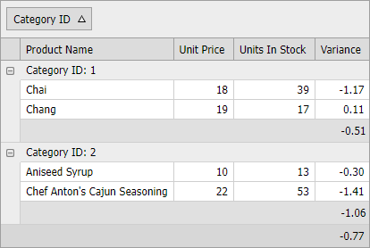

<!-- default badges list -->

[](https://supportcenter.devexpress.com/ticket/details/E3115)
[](https://docs.devexpress.com/GeneralInformation/403183)
<!-- default badges end -->

# Grid View for ASP.NET Web Forms - How to calculate a variance of two columns, variance of a group, and total variance

This example demonstrates how to calculate a variance of two [ASPxGridView](https://docs.devexpress.com/AspNet/DevExpress.Web.ASPxGridView) columns, variance of a group, and total variance. 



The [CustomUnboundColumnData](https://docs.devexpress.com/AspNet/DevExpress.Web.ASPxGridView.CustomUnboundColumnData) event handler calculates values of the unbound `Variance` column. 

```csharp
protected void grid_CustomUnboundColumnData(object sender, DevExpress.Web.ASPxGridViewColumnDataEventArgs e) {
    if (e.Column.FieldName == "Variance") {
        decimal unitPrice = Convert.ToDecimal(e.GetListSourceFieldValue("UnitPrice"));
        decimal unitsInStock = Convert.ToDecimal(e.GetListSourceFieldValue("UnitsInStock"));
        if (unitPrice != 0)
            e.Value = (unitPrice - unitsInStock) / unitPrice;
        else
            e.Value = 0;
    }
}
```

The [CustomSummaryCalculate](https://docs.devexpress.com/AspNet/DevExpress.Web.ASPxGridBase.CustomSummaryCalculate) event handler calculates custom group and total summaries. The event fires for each row involved in summary calculation. When calculating the total summary value, the event is raised for each data row (the `Calculate` stage), before (the `Start` stage) and after (the `Finalize` stage) processing rows. At the `Finalize` stage, the resulting total summary value is assigned to the [e.TotalValue](https://docs.devexpress.com/CoreLibraries/DevExpress.Data.CustomSummaryEventArgs.TotalValue) property.

```csharp
decimal totalSumUnitPrice;
decimal totalSumUnitsInStock;
protected void grid_CustomSummaryCalculate(object sender, DevExpress.Data.CustomSummaryEventArgs e) {
    if (e.SummaryProcess == DevExpress.Data.CustomSummaryProcess.Start) {
        totalSumUnitPrice = 0;
        totalSumUnitsInStock = 0;
    }else
    if (e.SummaryProcess == DevExpress.Data.CustomSummaryProcess.Calculate) {
        totalSumUnitPrice += Convert.ToDecimal(e.GetValue("UnitPrice"));
        totalSumUnitsInStock += Convert.ToDecimal(e.GetValue("UnitsInStock"));
    }else
    if (e.SummaryProcess == DevExpress.Data.CustomSummaryProcess.Finalize) {
        if (totalSumUnitPrice != 0)
            e.TotalValue = (totalSumUnitPrice - totalSumUnitsInStock) / totalSumUnitPrice;
        else
            e.TotalValue = 0;
    }
}
```

## Files to Review

* [Default.aspx](./CS/WebSite/Default.aspx) (VB: [Default.aspx](./VB/WebSite/Default.aspx))
* [Default.aspx.cs](./CS/WebSite/Default.aspx.cs) (VB: [Default.aspx.vb](./VB/WebSite/Default.aspx.vb))

## Documentation

* [Custom Summary](https://docs.devexpress.com/AspNet/3762/components/grid-view/concepts/use-data-summaries/custom-summary)
